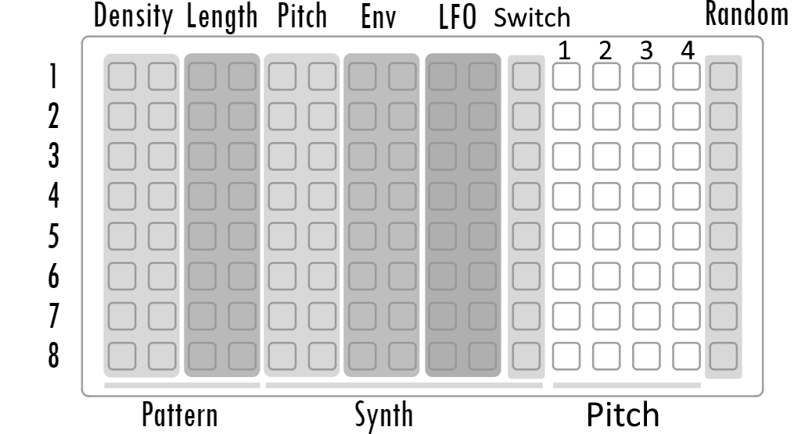

# rudiments

an 8 voice lofi percussion synthesizer...

## Installation

From the Maiden Project Manager (http://norns.local)

Or [Download latest release](https://github.com/cfdrake/rudiments/archive/master.zip) and copy files into `~/dust/code/rudiments`.

Or use Git:

```
<ssh into your Norns>
$ cd ~/dust/code
$ git clone https://github.com/cfdrake/rudiments.git
```

Note that after installing you must `SYSTEM => RESET` your Norns before running this script, as it includes a new SuperCollider engine.

## Norns Script

Launching randomizes all voices, and drops you into a euclidean sequencer. Controls are as follows:

```
Trigger View
E1 select
E2 density
E3 length

Pitch View
E1 select
E2 note
E3 (turn right) increment all pitches in sequence
E3 (turn left) randomly increment each pitch in sequence

Both Views
K1 = ALT
K2 reset phase
K3 start/stop
ALT-E1 = bpm
ALT+K2 = switch between trigger and pitch views
ALT+K3 = randomize all voices
```

Use the `PARAMS` menu to configure voices manually, set up clock/sync behavior, MIDI map, and manage voice presets. To switch between "Trigger View" and "Pitch View" press and hold down K1 and press K2 afterwards. Trigger View displays the trigger patterns for each track. Pitch View displays the note and pitch sequence for each track.

Each track has a fixed length pitch sequence of 4. Each step will offset the current note by either 0, +5, +7, or +12 semitones. Each time a trigger occurs, it will step forward 1 step in the pitch sequence. For example, the default note is 60 which is middle C. If the offset sequence is 0, +5, 0, +12, then you will hear midi note sequence 60, 65, 60, 72. Turn E3 to the right to increment all offsets, which would result in a sequence +5, +7, +5, 0 instead. If you turn E3 to the left, then for each step there is a 50% chance the offset will increment. Press a pad on the grid (columns 12 - 15) to increment the offset of a step. Pressing K2 only resets the trigger sequencer. 

## Grid Control
Tap in & clear rhythms with 1-4, nudge synth parameters up & down with 5-10.  Randomize the synth voice with 15


Column Pads (left to right)
1. Clear all triggers
2. Increase density by 1
3. Set length to 1
4. Increase length by 1
5. Decrease pitch by 1 note
6. Increase pitch by 1 note
7. Decrease envelope time
8. Increase envelope time
9. Decrease LFO time, behavior varies per synth
10. Increase LFO time, behavior varies per synth
11. Switch (ON/OFF), behavior varies per synth
12. Pitch sequence step 1
13. Pitch sequence step 2
14. Pitch sequence step 3
15. Pitch sequence step 4
16. Randomizes synth voice, behavior varies per synth

## nb synth controls

To turn off the internal supercollider engine Rudiments, find the parameter internal_ON_OFF and set it to 0 (default 1, ON). To use nb synths, the library nb is required as well as the nb mods for each synth you wish to use. 

In the parameter menu, there should be "nb_1" through "nb_8". There is an nb voice selector for each track in Rudiments. Multiple tracks can select the same nb voice. For example, multiple tracks can select doubledecker to play polyphonically. Or multiple tracks can select emplaitress 1 to combine multiple tracks into a more complicated monophonic sequence. 

Here are specific grid column behaviors (columns 9, 10, 11, 16) for each supported nb voice. 

### [nb_drumcrow](https://github.com/entzmingerc/nb_drumcrow)
9. Decrease pulse width (-0.05)
10. Increase pulse width (+0.05) (pw behavior changes for each drumcrow synth model)
11. ON/OFF: bit, bit lfo, and amplitude envelope bit
16. Randomizes env decay, pulse width, pulse width 2, and midi note of track

### [emplaitress](https://github.com/sixolet/emplaitress)
9. Decrease harmonics (-0.05)
10. Increase harmonics (+0.05)
11. Set FM mod to 0.9 (ON) or 0 (OFF)
16. Randomizes decay, harmonics, timbre, morph, and midi note of track

### [oilcan](https://github.com/zjb-s/oilcan)
9. Decrease modulation release for all 7 timbres (x * 0.9)
10. Increase modulation release for all 7 timbres (x * 1.1)
11. +1 midi note (ON) +0 midi note (OFF)
16. Randomizes frequency, sweep time, sweep index, env release, modulation release, modulation level, modulation ratio, feedback, and fold for all 7 timbres

Note: Midi note selects which of the 7 "timbres" is triggered! This value wraps around every 7 notes. Try using multiple rudiments rows to trigger the same Oilcan voice with each track at different pitches. The default midi note 60 selects timbre 4. Use column 11 switch for variation of selected timbres (+1 or +0). Use the pitch sequencer to vary the timbre sequencing. 

### [nb_rudiments](https://github.com/entzmingerc/nb_rudiments)
9. Decrease lfoFreq and lfoSweep parameters (x * 0.9)
10. Increase lfoFreq and lfoSweep parameters (x * 1.1)
11. Sets osc shape to square (ON) or sine (OFF)
16. Randomizes all parameters except osc shape and gain

### [doubledecker](https://github.com/sixolet/doubledecker)
9. Decrease brilliance (-0.05)
10. Increase brilliance (+0.05)
11. EACH PRESS will increment the layer 2 pitch ratio value and wrap through 9 values
16. Randomizes brilliance, amp release, portomento, and low and high pass filter parameters

## SuperCollider Engine

This script makes a new SuperCollider engine available, `Rudiments`. Please see `lib/engine_rudiments.sc` for the latest parameter definitions. The SuperCollider engine Rudiments was ported as an nb voice called [nb_rudiments](https://github.com/entzmingerc/nb_rudiments). Please refer to [nb](https://llllllll.co/t/n-b-et-al-v0-1/60374) if you'd like to add specific support for an nb voice.

## Thanks

Thanks to [@cfdrake](https://github.com/cfdrake) for creating rudiments  
Thanks to [@rbxbx](http://github.com/rbxbx) for porting the playfair sequencer to this engine  
Thanks to [@tehn](https://llllllll.co/u/tehn/summary) for writing playfair  
Thanks to [@yaw](https://llllllll.co/u/yaw/summary) for adding grid controls  
Thanks to [@sixolet](https://llllllll.co/u/sixolet/summary) for writing nb  
Thanks to [@postsolarpunk](https://llllllll.co/u/postsolarpunk/summary) for adding pitch view, grid controls, nb support  
